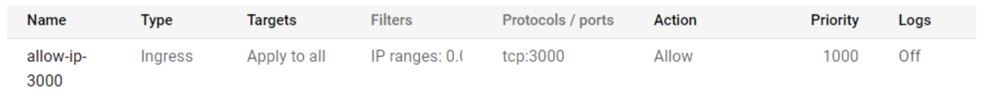

# Prerequisite
สิ่งที่ต้องทำก่อนการ run project ในทุกหัวข้อ
1. ดาวโหลด source code หรือทำการ clone project จาก: https://github.com/Lomidaf/Cloud-com-2022-final-proj
2. ทำการ Sign in firebase และทำการ Add project ด้วยชื่อ project ที่ต้องการ
3. เข้าไปยัง Authentication ของ firebase โดยเลือก Sign-in method เป็น email/password
4. ทำการ Sign in ไปที่ vision ai ทำการ enable api และทำการสร้าง service account โดยโหลด key ของ service account นั้นเข้าเครื่อง
5. ทำการติดตั้ง postgre ภายในเครื่องและทำการสร้าง database ที่จะใช้รองรับในการเก็บข้อมูล application (ในกรณีที่ Run local)
6. ทำการติดตั้ง node (>=16.9.1), typescript, yarn และ npm บนเครื่องที่ต้องการทำการ run หรือ deploy application

# Running locally (Development mode)
กรณีการติดตั้งและใช้งาน locally
1. สร้าง file .env บน root ของ folder backend และ frontend โดยต้องมี template ตาม .env.example ใน backend และ frontend และทำการเติม configuration ต่าง ๆ ภายในให้ครบถ้วน โดยด้านล่างจะเป็นภาพตัวอย่าง env บน frontend
```
NEXT_PUBLIC_API_KEY = ""
NEXT_PUBLIC_AUTH_DOMAIN = ""
NEXT_PUBLIC_PROJECT_ID = ""
NEXT_PUBLIC_STORAGE_BUCKET = ""
NEXT_PUBLIC_MESSAGING_SENDERID = ""
NEXT_PUBLIC_APP_ID = ""
NEXT_PUBLIC_BACKEND_URL = ""
```
2. โดยการเติม configuration บน .env จะมี configuration ของ firebase ที่ต้องทำการโหลด key ของ firebase project และนำมาเติมเข้าไปยัง .env และจะ configuration ในส่วนของ vision ai ซึ่งจะต้องทำการระบุ path ของ key ที่ได้ทำการโหลดมาจากขั้น 6.1.4 
3. ทำการลง dependency ต่าง ๆ ของ project ด้วยการเข้าไปยัง root folder frontend และ backend แล้วพิม `yarn` (Frontend), `npm install` (Backend) 
4. ทำการเปิด server โดยเข้าไปยัง root folder frontend หรือ backend และทำการใช้คำสั่ง `yarn next dev` (Frontend) หรือ `npm run start:dev` (Backend) ในกรณีเป็น Development ถ้าหากเป็น Deployment จะใช้คำสั่ง `yarn build` ตามด้วย `yarn start` (Frontend) หรือ `npm build` ตามด้วย `npm start` (Backend)
5. สามารถทำการเข้าถึงหน้าเว็ป (Frontend) ได้จาก localhost:3000 และในส่วนของ api server (Backend) จะสามารถเข้าถึงได้ผ่าน localhost:port/api ซึ่ง port นั้นจะตาม .env ที่ได้ตั้งไว้เมื่อขั้นตอนก่อนหน้า

#Deploy on cloud
กรณีการติดตั้งและ deploy application ขึ้น cloud
1. สร้าง project ใหม่บน google cloud หรือใช้ project เดิมที่มีอยู่แล้ว
2. สร้าง instance ใน Google Cloud SQL โดยใช้ database engine เป็น PostgreSQL และทำการแก้ไข network ให้สามารถใช้ private ip สำหรับเชื่อมต่อ backend ได้
3. สร้าง instance ใน Google compute engine สำหรับ backend และ frontend server โดยเลือก turn on HTTP 
4. เพิ่ม rule สำหรับ TCP port 3000 (เปลี่ยนตาม port ที่ใช้งาน) ที่ firewall rules ของ network interface ทั้ง frontend และ backend

5. SSH เข้า server, update โปรแกรม และ install git จากนั้น pull project ลงมาและทำตามขั้นตอน 6.2.1 ถึง 6.2.4 โดยในขั้นตอน 6.2.2 จะต้อง upload key สำหรับ vision ในขั้นตอน 6.1.4 ไว้ใน backend server
6. สามารถเข้าถึงหน้า website ได้จาก external ip ของ frontend server port 3000 และในส่วนของ api server จะสามารถเข้าถึงได้ผ่านทาง external ip ของ backend server ซึ่ง port จะตาม .env ที่ได้ตั้งไว้
